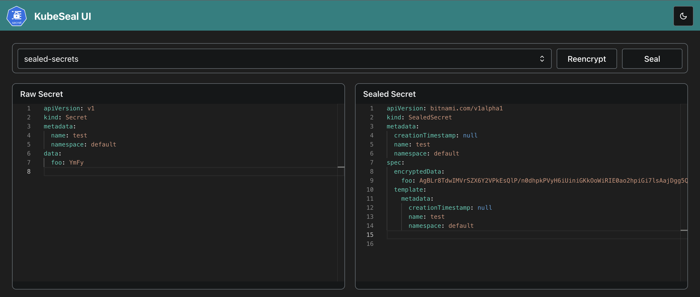

# KubeSeal UI

A web frontend for Sealed Secrets by Bitnami

> **Warning**
> KubeSeal UI is actually in development

 

## What is KubeSeal UI?

Kubeseal UI is a web interface for Sealed Secrets by Bitnami. Sealed Secrets lets you manage your K8s secrets in git by
encrypting/sealing your Secrets and decrypting them once they get deployed to your K8s cluster. To seal your secrets you
usually use the corresponding command line tool kubeseal and KubeSeal UI wraps it into a web interface.

## Why KubeSeal UI?

In a simple scenario where you have one K8s cluster with one sealed secrets controller deployed KubeSeal UI just gives
you a web interface to seal your secrets. There may be complexer scenarios with one K8s cluster and multiple sealed
secret controllers deployed or even a multi cluster environment with one or more sealed secret controllers deployed on
each cluster. With KubeSeal UI users of Sealed Secrets don't have to set up the kubeseal command line tool and
connections to one or more clusters to seal their secrets. You configure all clusters and available sealed secret
controllers in one single place.

## Documentation

To learn more about KubeSeal UI and getting
started, [go to the documentation](https://br4sk4.github.io/kubeseal-ui/docs).
